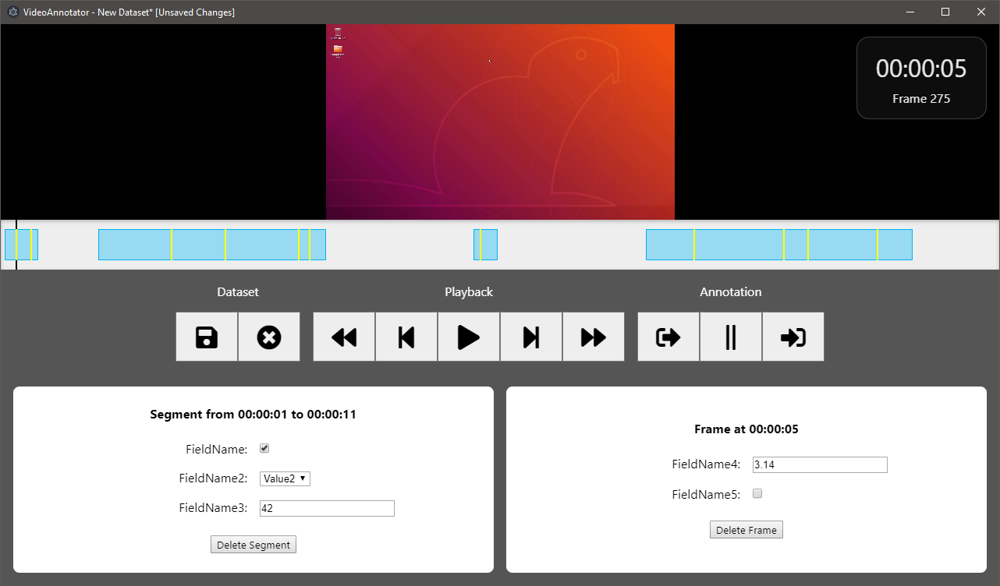

VideoAnnotator
==============

VideoAnnotator is a graphical tool to facilitate the annotation of video files with custom metadata that can then be ingested by data processing pipelines and used as training data for machine learning algorithms. It is primarily intended for use by artificial intelligence and computer vision researchers.

Features:

- Provides a standard timeline-based view (reminiscent of popular video editing tools) for simple and intuitive editing of annotations.
- Generates data input controls based on user-supplied metadata schemas and performs automatic data validation at the point of entry.
- Supports all video formats that are [supported by Chromium](https://developer.mozilla.org/en-US/docs/Web/HTML/Supported_media_formats#Browser_compatibility).

**You can download the installer for the latest version of VideoAnnotator from the [releases page](https://github.com/adamrehn/VideoAnnotator/releases).**


## Contents

- [Using VideoAnnotator](#using-videoannotator)
  - [Creating schema files](#creating-schema-files)
  - [Annotating videos](#annotating-videos)
- [Building VideoAnnotator from source](#building-videoannotator-from-source)
  - [Requirements](#requirements)
  - [Build process](#build-process)
- [Legal](#legal)


## Using VideoAnnotator

### Creating schema files

All datasets in VideoAnnotator must be accompanied by an information schema that defines the metadata fields for the dataset. Schema files can be written in either JSON or YAML and must adhere to the following structure:

```yaml
# There must be a top-level key called "fields"
fields:
  
  # There must be a nested key called "segments" that lists the metadata fields that apply to entire segments of a video
  segments:
    -
      # Each field must have a unique name
      name: FieldName
      
      # Each field must have a datatype (supported types are boolean, float, int, and string)
      type: boolean
    -
      name: FieldName2
      type: string
      
      # You can define a list of valid values for a field instead of allowing arbitrary values
      values:
        - Value1
        - Value2
        - Value3
    -
      name: FieldName3
      type: int
  
  # There must be a nested key called "frames" that lists the metadata fields that apply to individual frames within a segment
  frames:
    -
      name: FieldName4
      type: float
```

Once you have created a schema file then this can be used when creating a new dataset in VideoAnnotator.

### Annotating videos

When you first open VideoAnnotator you will be presented with a screen providing options to load an existing dataset from file or create a new dataset. Creating a new dataset requires that you specify a video file and an accompanying schema file.

Once you have created or opened a dataset you will be presented with the main annotation window. A screenshot of the annotation window is shown below.



The window is laid out as follows:

- The video itself is at the top of the window, with an overlay in the top-right indicating the current playback position and frame number.
- The timeline is displayed immediately below the video, which includes a vertical line indicating the current playback position and indicators for any annotated segments and frames in the dataset.
- A row of controls are displayed below the timeline, including a save button, a close button, playback controls, and annotation controls for defining segments and marking individual frames for annotation.
- Two boxes are displayed at the bottom of the window. The box on the left displays the metadata input controls for the currently selected segment (if any) and the box on the right displays the metadata input controls for the currently selected frame (if any.)

The workflow for annotating a video commonly involves the following steps:

1. Seek through the timeline to the point at which you would like to start an annotated segment. Click the "Start a new segment" button to create a new segment that starts at the current playback position. By default new segments will have their end point set to the maximum position in the timeline that does not collide with any other segments.
2. Seek through the timeline to the point at which you would like to end the current segment and click the "End the current segment" button to truncate the segment to end at the current playback position.
3. Use the segment metadata input controls to set the metadata values for the current segment.
4. Seek through the timeline to identify any individual frames within the segment that you would like to annotate with metadata. Click the "Annotate this frame" button to add an annotation to the frame at the current playback position.
5. Use the frame metadata input controls to set the metadata values for the current frame.
6. Repeat as necessary for additional frames or segments.

Once you have finished annotating a video then you can save the dataset by clicking the "Save the dataset" button and specifying an output filename. VideoAnnotator datasets are stored in JSON format for easy ingestion by data processing and transformation pipelines. If you would like to annotate another video then you can click the "Close the dataset" button to return to the dataset selection screen.

**An important note about file linkages:** JSON dataset files store references to their corresponding schema and video files as **relative paths**, which means moving a JSON file or its corresponding schema or video file in a manner that alters their relative filesystem positions will break the linkage. For maximum portability, the simplest option is to simply store these files in the same directory, which can then be moved freely without breaking the linkages between the files it contains. If you are storing the files in separate directories then it is strongly recommended that you establish a filesystem layout convention for any given project and adhere to it, so that the root project directory can be copied or moved without breaking any linkages.


## Building VideoAnnotator from source

**Note: building VideoAnnotator from source is only required if you wish to modify the source code. This process is not necessary for researchers who simply want to use the tool as it is - the prebuilt installer for the latest version of VideoAnnotator can be downloaded from the [releases page](https://github.com/adamrehn/VideoAnnotator/releases).**


### Requirements

Building VideoAnnotator from source requires [Node.js](https://nodejs.org/) version 8.0 or newer.


### Build process

First, install dependencies using:

```
npm install .
```

You can then run the application using:

```
npm run start
```

or package it using:

```
npm run dist
```

To clean the generated files, use:

```
npm run clean
```


## Legal

Copyright &copy; 2019, Adam Rehn. Licensed under the MIT License, see the file [LICENSE](./LICENSE) for details.
